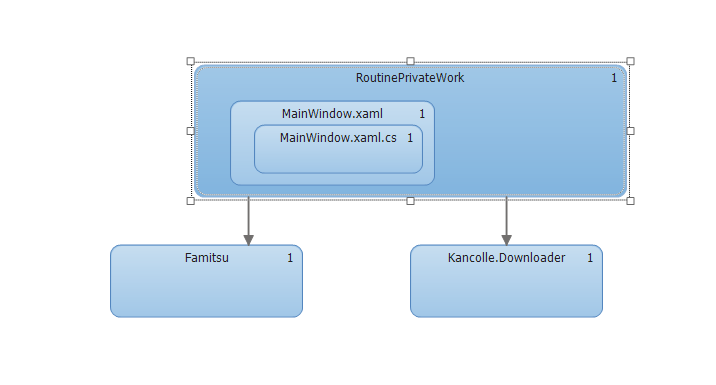
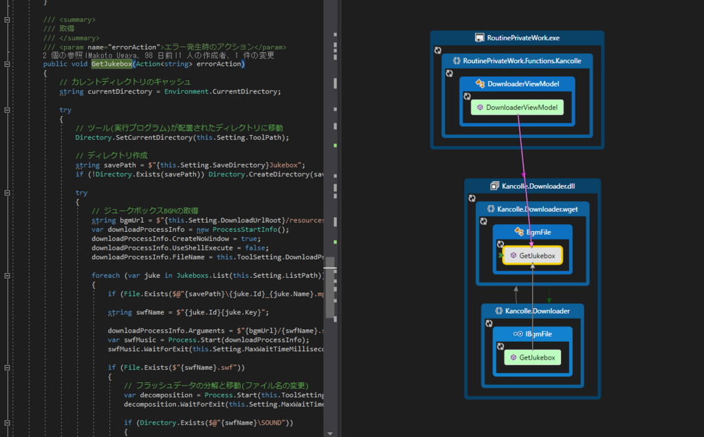

## 記事の目的
Visual Studio には3つのエディションがあり、価格と機能が異なります。  
この記事では、各エディションの特徴を整理して、自分の目的に合ったエディションを選択できるようにすることを目的とします。

:::info
Visual Studio 各エディションの比較 https://www.visualstudio.com/ja/vs/compare/
:::

## 無償版(Community)ではできないこと

一般的な企業(営利団体従事者)で5名を超える開発者がいる場合、Community は使用できないことになっており、  
Professional か Enterprise を使用する必要があります。

> (注) 大学関係者、非営利団体従事者、オープン ソース開発者は人数の制限なく、  
> また、中小企業 (PC 台数 250 台未満かつ年商 1 億円未満) においては、最大 5 名までご利用いただけます。  
> 詳しくは [Visual Studio ライセンス ホワイト ペーパー](http://www.microsoft.com/ja-jp/download/details.aspx?id=13350)をご確認ください。

## Professional でできること

Community 版と機能的にはほとんど同じです。

### CodeLens

コードレンズは、ソースコードを解析して、クラスやプロパティ、メソッドなどの被参照箇所の情報と変更履歴情報が表示される機能です。  
「自分の作るアプリケーションは、規模も小さいしそもそも一人でやっている」という方は一見必要のない機能に見えるのですが、  
例えば「このメソッドに修正を加えると、どこに影響するか？」といったケースで影響箇所を調査するとき、参照箇所が数値で表示されているメリットは大きいです。  

参照数が多ければ、変更したときの確認項目も増える傾向にあるため、実際の開発においては、工数見積の指標(根拠)としても使えます。  

変更履歴情報については、履歴管理システムと連動して
不具合が発生した時等に何の修正によって事象が発生しているのか、追跡が容易になります。  
また、リリース後にメソッドレベルであまりにも頻繁に変更が行われている場合は何らかの設計不備が疑われるため、見直しを行う契機にもなります。  

## Enterprise でできること
Enterprise は、開発を効率的に進めるための強力な機能を使用できます。  
Professional と Enterprise にはどちらも評価版が存在し、最大で90日間のお試し利用が可能です。  

### ライブ依存関係検証
定義済みの依存関係に違反したコードを書くと、エラーにしてくれる機能です。  
抽象クラスやインターフェースが具象クラスの実装仕様に依存していたり、アセンブリ間の参照関係を崩してしまうような場合に警告を出します。  

コードのアーキテクチャを理解したメンバーであれば、そもそも不要な依存関係を生まないよう注意してコードを書いているものですが、  
他のメンバーが常にそこまで気を付けて書いてくれる保証はどこにもありません。

この機能を使うと、コードレビュー前のコンパイル時点で依存関係を乱すコードを見つけることが可能になります。

https://msdn.microsoft.com/ja-jp/library/dd409453.aspx

### アーキテクチャ レイヤー図

レイヤー ダイアグラムを作成することができます。

https://msdn.microsoft.com/ja-jp/library/dd465141.aspx

### アーキテクチャの検証

あまり詳しい説明が見当たらない、、、  
下記の説明をご参照ください。  
https://msdn.microsoft.com/ja-jp/library/hh871439.aspx

### コード クローン
ソースコード量が増えてくると、似たようなコードを量産してしまい修正時のメンテナンスコストが増加するケースがあります。  
コード クローンは2012から追加された機能で、コードが重複している箇所を見つけ出します。

重複箇所を抽象化して分離できれば、規模が大きくなってもメンテナンスしやすいコードを維持できます。

https://channel9.msdn.com/Series/Visual-Studio-2012-Premium-and-Ultimate-Overview-JPN/Visual-Studio-Ultimate-2012-Finding-and-managing-cloned-code-JPN

### IntelliTrace

トラブルシューティングで、なかなか事象が再現できず困ったとき、実行中に発生している例外やイベントからヒントを得る必要があります。  
そんなときは、IntelliTraceの機能を使うと後から問題のあった箇所の呼び出し履歴を確認できます。  
どのメソッド呼出で例外が起きるのか、ステップ実行して追跡する必要はありません。  

また、私は試したことはありませんが、下記のように開発者以外のPCにおいてもイベント収集が可能となっています。  
ユーザー環境にリリースした後、ユーザーサポートの対応中にどうしても事象を再現できず解決に至らない場合、こういったツールが力を発揮するかも知れません。  

> IntelliTrace には、Visual Studio を接続できない他の環境に配置できる、スタンドアロン コレクターもあります。  
> インストール処理を実行しないので、管理者の抵抗を受ける心配は不要です。  
> ターゲット環境にコレクターをコピーできるかどうかかどうかだけが問題です。  
> コレクターでは、アプリケーションの実行が .itrace ファイルに記録されます。  
> 開発者はこのファイルを開発コンピューターに転送して Visual Studio で開くことができます。  
> このシナリオは、デバッグ中にアプリケーションの実行を制御できないので、"非ライブ デバッグ" と呼ばれます。  
> IntelliTrace スタンドアロン コレクターの使用法に関する最新情報については、[aka.ms/itracecollector](http://aka.ms/itracecollector) (英語) を参照してください。

https://msdn.microsoft.com/ja-jp/magazine/dn973014.aspx

### コード マップ デバッガーの統合

Professional で利用可能な CodeLens 機能は、該当するクラスやメソッドの利用箇所を表示してくれます。  
コードマップは、この表示をさらにグラフィカルに表示し、影響範囲の全体像を確認することが可能です。

https://msdn.microsoft.com/ja-jp/library/jj739835.aspx

### .NET メモリ ダンプ分析
.NET アプリケーション(4.5以上が対象)のヒープメモリデバッグを行う機能です。  
メモリ利用状況に意図しない問題が発生している場合、メモリダンプを取得してどのオブジェクトがメモリを使用しているか、適切なGCが行われているかといった確認を行うことができます。  

https://msdn.microsoft.com/ja-jp/library/dn342825.aspx

### Live Unit Testing
2017の目玉機能の一つです。  

TDD(テスト駆動開発)を進めるために、まず単体テストを書き、その単体テストをパスするための最低限のプログラムコードを書き、  
全てのテストが通るようになったらリファクタリングを行い、リファクタリングが終われば次の機能の単体テストを書く、、、  
というサイクルにおいて、 Live Unit Testing を有効にしておくと、書いたコードによってテスト結果がどう変わったかをリアルタイムに評価してくれます。  

開発コストを下げるためには、なるべく早い工程で間違い(バグ)を検出して修正してしまうことが有効であると言われており、事実コストにも如実に反映します。

もしもユーザーにリリースした後に問題が発覚すれば、コードの修正だけではなく影響調査を行い関連する範囲も含めた再テストや、  
再リリース(社内規定に従ったリリース手続きの再実施)、ユーザー周知など、作業だけでも大変な手戻りが発生するとともに、  
信頼の低下、ユーザー離れなど、ビジネスの機会損失にも繋がりかねません。  

いかに開発の早い段階で問題を検出するか、という取り組みは  
ShiftLeft と呼ばれており、プロジェクト管理界隈でも標準的な考え方として取り入れられています。  

慣れないうちは、単体テストから機能を作っていく作業を煩わしく感じてしまいついつい機能から先に作って、後からテストを作成するといった進め方に  
なってしまうことが多いと思われますが、単体テストを先に書くことで、何を意図した機能なのかが明確になり、テスト可能な形で処理分割を強制されるため、  
自ずと単一責務の原則(SOLID原則のS)を意識したコードになります。  

Live Unit Testing が無いときは、単体テストが通ることを定期的に実行して確認しなくてはなりませんでした。  
この機能によってリアルタイムでテストが行われて結果が表示されるため、どの修正によってテストが通らなくなったのかが瞬時に判明します。  

ぜひ、試用版で効果を確認してみて下さい。

### テスト ケース管理
TFSのテストマネージャありきの機能になりますが、特定機能のテストシナリオに対して単体テストを紐づけて管理することが可能になります。  
バグ修正後のリグレッションテストなどで効果を発揮する機能と言えます。

https://msdn.microsoft.com/ja-jp/library/dd380741.aspx

### Web ロードおよびパフォーマンス テスト
Webアプリケーションに対して、負荷テストを行うことができます。  
ブラウザアプリケーションだけでなく、WebAPIに対しても負荷の高い状態でどの程度のパフォーマンスが出るのか計測することができます。  

この機能は主にサーバサイドのパフォーマンスを計測するもので、クライアントサイドのパフォーマンスは他の方法で計測を行う必要があることに注意してください。    

### IntelliTest
Live Unit Testing の項では、先に単体テストコードを書くことの重要性について説明しました。  
しかし、既に商用としてリリースされているアプリケーションで、テストカバレッジが低い上に単体テストが書きにくいアプリケーションを預かり  
メンテナンスしなければならないケースもあると思います。

そういった場合に、機能を追加したり、リファクタリングを行うだけで既存の機能を壊してしまうことが往々にして発生します。  
これを防ぐためには、既存のコードに対して単体テストを書いてから修正を行うというアプローチが考えられます。  

しかし、これを手作業で行うには思ったよりも手間がかかります。  
まず、テストが成功したとしても本当に仕様通りなのか判断することができず、密結合されたクラスがあれば、影響箇所全てのテストを書く必要があり、  
もし一部のクラスについてテストを書かなかった場合に、致命的な影響が出ていても気づくことができません。  

そこで、これまでに紹介した機能を使って修正対象のクラスを参照するすべての箇所について、  
IntelliTest を使って単体テストを自動生成することで、少しでも修正による不具合発生のリスクを低減することが可能です。  

https://msdn.microsoft.com/ja-jp/library/dn823749.aspx

### Microsoft Fakes (単体テストの分離)
当たり前の話ですが、単体テストは製品版のコードが記述されるまで「失敗」状態から変わることはありません。  
(もしコードを書かずに「成功」となるテストがあれば、 それは単体テストで保障すべき振る舞いではありません)

しかし、開発の規模によっては、計画上一部の機能は仕様が未確定で、既に仕様が確定した機能から開発するといったことがあります。  
その場合、仕様検討中の機能を前提とした他の機能の単体テストは、前提とする機能が完成するまでテストが「成功」になることは無いのでしょうか？

いいえ、そんなことをやっていたら非効率です。  
そもそも、単体テストで保障するのは「単体」レベルの機能の振る舞いであって、他の機能と結合したときの動作ではありません。  

Microsoft Fakes は、まだ未完成の機能や、単体レベルのテストにおいて  
実際に処理を行う必要が無い機能(WebアクセスやDB操作等)を代替する手段を提供します。

具体的には、テスト対象機能が必要とする具象クラスを、偽装したクラスで置き換えます。  
※例えばWebページのアクセスを偽装して、毎回固定のレスポンスを返すなど  
こうすることで、先に実装した機能の責任範囲だけを単体テストで保障することができ、  
後で他の機能が完成したときに、具象クラスに置き換えても動作することを確認できます。  

https://msdn.microsoft.com/ja-jp/library/hh549175.aspx

NuGetでも、Moqという代替オブジェクトを生成するライブラリが公開されています。  
Microsoft Fakes はお手軽自動生成、Moqは自由に具象クラスを定義して使うイメージで、どちらが使いやすいかはお好みですね。

https://github.com/moq/moq4

### コード カバレッジ
記載したコードの動作を単体テストでカバーしている割合を分析します。
カバレッジが品質に与える影響は、一定の割合で頭打ちになると言われており、100％に近づけば近づくほど品質が向上するといったものではありません。

カバレッジを取得する目的として、「機能を追加したが、単体テストは書いていない」といったコードコミットをカバレッジの低下によって察知し、  
マージ前にコードの品質を推察できるようにすることです。  

テストを追加せずに機能を追加すれば、カバレッジは低下し、そのコードの品質も評価はできない (良くはない)と言えます。  
カバレッジを分析して、修正によってカバレッジが低下しないことを品質向上のための取り組みとしましょう。

### Lab Management
こちらもTFSありきの機能です。開発したアプリケーションの検証環境構築をサポートする機能なのですが、  
簡単なサンプルを使った検証が難しく、動きを確認できていないため、説明は省略させてください。

https://msdn.microsoft.com/ja-jp/library/dd936084.aspx

### コード化された UI テスト
結合テストレベルのテストをコードで記述して自動実行します。  
UIの操作を記録して、テストコードを自動生成することも可能です。  

https://msdn.microsoft.com/ja-jp/library/dd286726.aspx

個人的には、MsTestベースで利用できる Friendly もおすすめです。  
Friendlyテストプロセスから、テスト対象のプロセスのメソッド、プロパティ、フィールド全て我が物のように使う事ができます。  

Friendly・・・お前のものはおれのもの。おれのものもおれのもの。だっておれたち ともだち (Friendly) だろう？  
http://www.codeer.co.jp/AutoTest

### クロス プラットフォーム開発
主に、[Xamarin](https://docs.microsoft.com/ja-jp/xamarin/get-started/what-is-xamarin)を拡張するための機能です。  

:::tip
**Xamarin**とは  
SharedLibrary や PCLをベースに iOS・Android・UWP でマルチプラットフォーム開発を可能にする製品
:::

#### 埋め込みアセンブリ
相互運用機能型の情報をアセンブリに埋め込みます。  

#### Xamarin Inspector

Xamarinアプリケーションの詳細なデバッグを行うことができます。  
https://developer.xamarin.com/guides/cross-platform/inspector/

#### Xamarin Profiler

Xamarinアプリケーションのプロファイリングを行うことができます。  
IntelliTrace まではいきませんが、アプリのパフォーマンスに関わる情報や、メモリ・オブジェクトの利用状況を確認することができます。  
http://ytabuchi.hatenablog.com/entry/2016/08/18/233000

#### Remoted iOS Simulator for Window
Windows上で iOS アプリのシュミレーションが可能になる機能です。  
Visual StudioがMacに少なくとも1回は接続されていることが前提となっているため、純粋にWindowsしか無い場合は利用できませんのでご注意ください。  

https://developer.xamarin.com/guides/cross-platform/windows/ios-simulator/

----------

## まとめ

* PC台数250台以上、または売上1億円以上ならProfessional以上のエディション必須
* CodeLens を使いたいなら Professional
* テストの自動生成など、品質向上機能を使いたいなら Enterprise

はっきり言って Enterprise のお値段は非常に高いですが、機能は本当に優れていて購入代金以上のメリットを得られる可能性があります。  

Visual Studio 2017 の新機能については、[こちら](https://docs.microsoft.com/ja-jp/visualstudio/ide/whats-new-in-visual-studio)をご確認ください。
