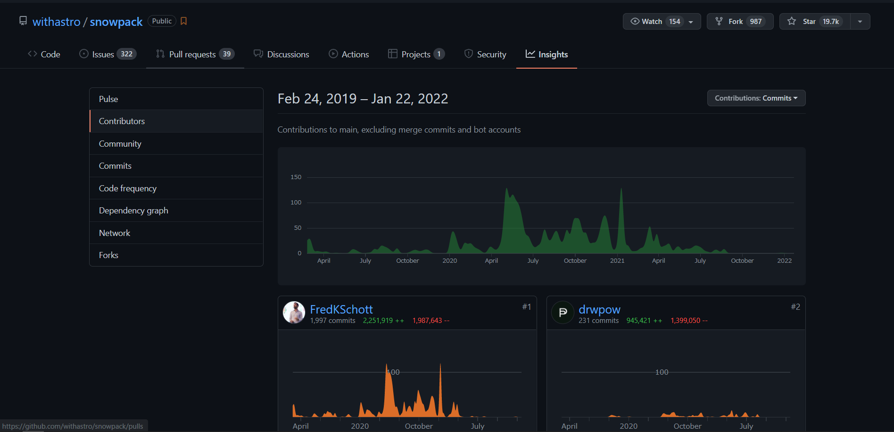

## Jest v27 にアップデートすると、 Jest 実行時にエラーが出る

Snowpack の Issue [#3398](https://github.com/withastro/snowpack/issues/3398) で報告されている通り、  
React 向け Jest config 内で参照している Jest バージョンが古いため、実行時エラーになってしまう

```
● Test suite failed to run
TypeError: Cannot destructure property 'config' of 'cacheKeyOptions' as it is undefined.
  at Object.getCacheKey (node_modules/babel-jest/build/index.js:217:14)
```

私が確認した環境では全てのテストで上記のエラーが出ていた

## 原因

- npm で配信されている Snowpack の最新版は v3.8.8(2022-01-22現在)
- Jest 利用時の config として[推奨](https://www.snowpack.dev/guides/jest)されている `@snowpack/app-scripts-react` は v2.0.1 が最新で、  
  最終リリースは2021-03頃
- 同一リポジトリで管理されている[@snowpack/app-scripts-react](https://github.com/withastro/snowpack/blob/97b2e94e627cab0e79162ce4ed7a3768d64b5591/create-snowpack-app/app-scripts-react/package.json#L23)は v2.0.1 時点だと babel-jest v26.2.2 を参照している
- その後、[f77639b](https://github.com/withastro/snowpack/commit/f77639b81f61c47b69f7a5df27648f36146ab25f#diff-e5b2a9577e92c42f45ebb12756f19173200914f261c323ee12bc8f76da565261)のコミットで Jest v27 対応が行われているが、リリースが行われておらず npm が更新されない

## 暫定対応

### 問題のパッケージをアンインストール

- `@snowpack/app-scripts-react` をアンインストール
- Jest の config ファイルから require を削除して、transform など必要な箇所のみコピー
  - `babelTransform.js` `fileTransform.js` `importMetaBabelPlugin.js` の3ファイルをコピーした

### 必要なパッケージを個別にインストール

下記のパッケージが不足した状態になるので追加インストールする

- `babel-jest`
- `babel-preset-react-app`
- `@snowpack/plugin-dotenv`

### Jest v27 にアップデートする

- @types/jest も合わせて v27 にアップデートする

### 動作確認

テストが成功することを確認する

import Tabs from '@theme/Tabs';
import TabItem from '@theme/TabItem';

<Tabs>
  <TabItem value="npm" default>

```sh
npm run test
```

  </TabItem>
  <TabItem value="yarn">

```sh
yarn test
```

  </TabItem>
</Tabs>

## Snowpack はもう開発してない？

2021年10月以降リリースも無く、コードもほとんど動いていない



今どんな状態なんだろうか・・・  
CRAv5 + Vite が安定して動いているので鞍替えしようかな

