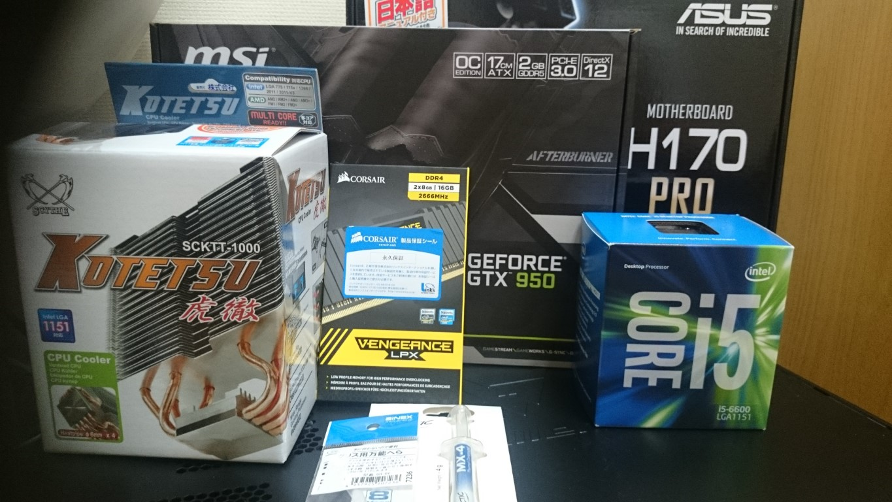
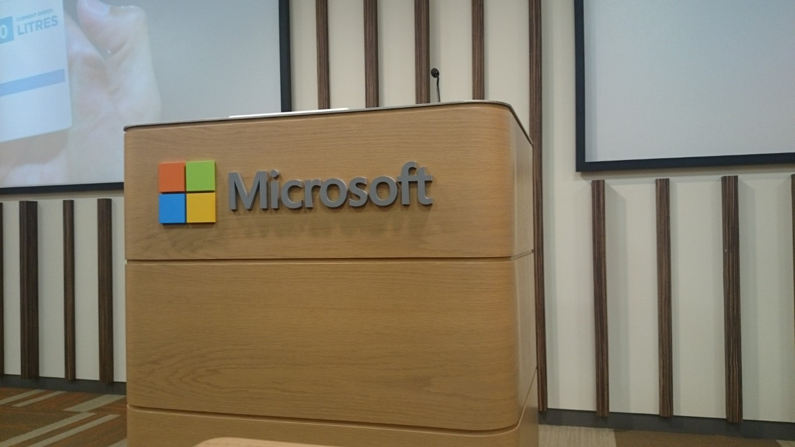
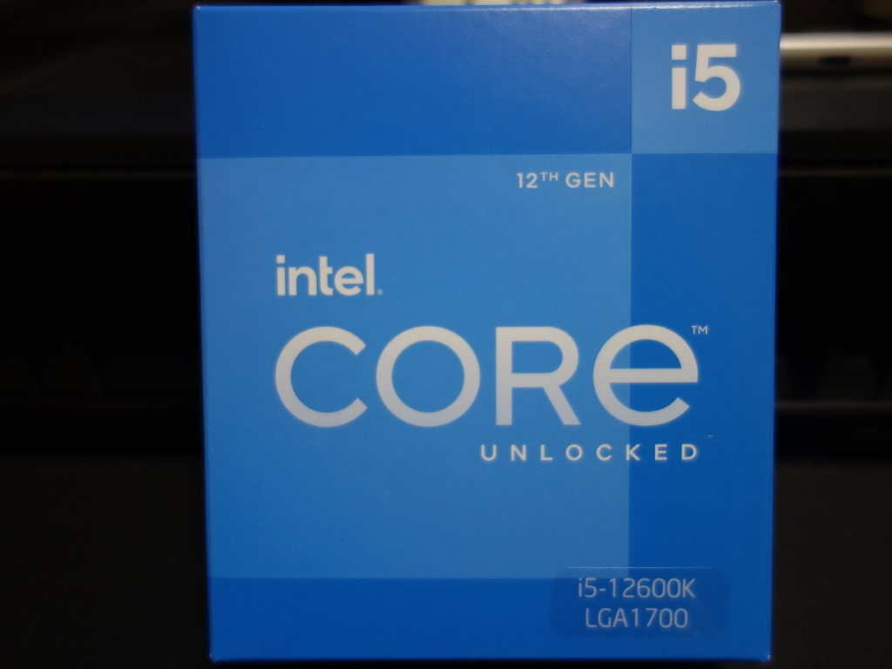
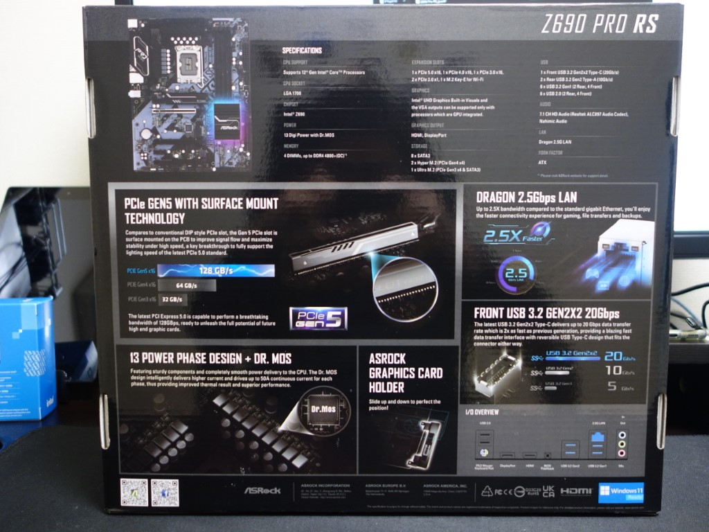
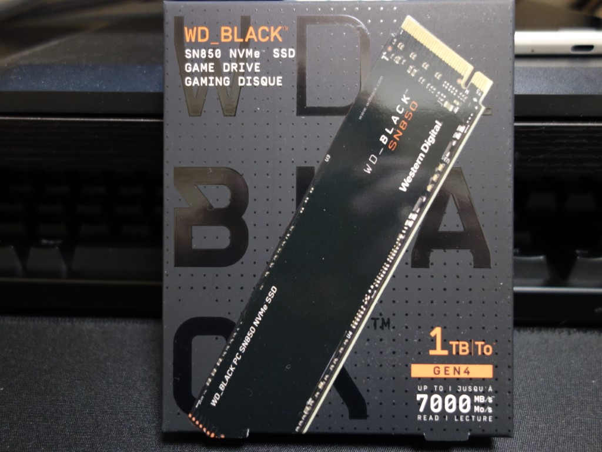

## 自宅のPC変遷

自宅の私用 PC は自作するようにしている。 最初は BTO で購入したものを、部分的にパーツを交換しながら使い続けている感じだ。
最初に購入したのは2010年末、ドスパラの Prime Galleria XT というシリーズで約10万円という安めのもの。
当時は MMORPG にハマっていたので、遊んでいるゲームがそこそこ動く程度のスペックを選んだ。

構成は以下のようなものだった。

| Parts | Spec |
| ----- | ----- |
| CPU | INTEL Core i7-870 BOX(1156/2.93/8M/1333) |
| MB | ASRock H55DE3(H55 1156 DDR3 ATX rev.3) |
| MEM | ADT 10241991(DDR3 PC3-10600 4GB) * 2枚 |
| GPU | Palit NE5TX470F09DA(GTX470 1280M GDR5 2D1H bulk |
| HDD | SANSUNG HD154UI(1.5TB) |
| PS | Delta 750W 型番不明 |
| CASE | TOWER / ATX |

2016年頃までこのマシンを使っていたが、次第に動作の遅延を顕著に感じ始め、
Windows 10 がサクサク動くくらいのスペックの PC が欲しくなってきた。  
最初の候補は新しい BTO PC を購入することだったが、想定よりも結構値段が高い。  
同グレードのPCが2010年頃と比べて1.5倍くらいの価格になっている。

パーツ交換くらいは仕事でも散々やっていたので、  
「必要なパーツだけ入れ替えれば安く済むのでは？」と思い、必要なパーツのみ最新化することにした。

この時購入したパーツは以下のとおり。

| Parts | Spec |
| ----- | ----- |
| CPU | Intel CPU Core i5-6600 3.3GHz LGA1151 |
| COL | 虎徹 12cmサイドフロー SCKTT-1000 |
| MB | ASUSTeK H170-PRO |
| MEM | CORSAIR DDR4 VENGEANCE LPX Series 8GB×2枚 |
| GPU | MSI GTX950 2GD5 OC |

CPU クーラーはしっかりしたのがいいぞ、という記事を見かけて購入したけれど、
CPU にも付属のクーラーがあったのでそこまでハードに使うことも無かったしいらなかったかも知れない。
虎徹もそんなに高くないので、ちょうど良い勉強になった。

これとは別に、フロントの3.5インチベイが空いていたので OWL-CR6U3(B)/BOX という
SDXC とかが使えるマルチカードリーダライタを購入した。

パーツ同士が非互換になることもなく、入れ替えは順調に行うことができた。

交換して不要になったパーツは、ドスパラの買取サービスに持ち込んで買い取ってもらうことができた。
記憶が曖昧なところだが、確か買取額が合計5,000円以上になって意外に高額になったと嬉しかった覚えがある。

パーツ交換によって Windows 10 もサクサクと起動・動作するようになった。
この経験から「自宅の PC は、故障する前に5年毎で必要なパーツを入れ替えると良い」という考えになっていった。

## 2022年、そろそろ Windows 11 を試したい

2016年から早くも5年が経過した。今は2022年。Windows OS の新しいバージョンもリリースされており、
無償アップデート期間中である。

Windows 10 を動かすには 2016年に組み上げた PC でも十分だったが、
Windows 11 では Intel 6th Gen の CPU をサポートしていない。

LGA1151 でもインストールできないことは無さそうだが、このまま無理に使い続けても価値が下がる一方で
いつ故障してもおかしくない期間に入っていくことになる。
BTO PC を新規購入しようとすると、希望するスペックだと予算10万円を超えてしまう。

Microsoft に踊らされている感もなくはないが、この機会に再度パーツを新調することにした。

### CPU は LGA1700

幸いにも 2021年10月頃に LGA1700 が発売されており、関連製品も充実してきている時期なので
最新の 12th Gen CPU を購入することにした。
Core i9 はハイスペックで魅力的だが、YAuth を通せる気がしないので Core i5 で十分だと思い込むことにした。

CPU のソケットにマザーボードを合わせる必要があることは前回の経験から知っていたので、
LGA1700 対応のマザーボードを ASRock の手頃な価格帯のものから選んだ。

### Storage は M.2

幸いにも HDD は故障せず、今でもドスパラの BTO マシンに取り付けられていたものが元気に稼働しているが、
SSD の速さを知ってしまったので、1TB の SSD を購入して OS の再インストールをしたりしていた。
(確か2020年頃だったと思う)

一方、SSD よりもかなり高速な Storage が存在していて、購入予定のマザーボードではヒートシンクも付属している
ということで、俄然興味が湧いてきた。
Windows 11 のアップグレード前に OS は再インストールしたかったので、M.2 Storage を新たに購入して
これまでに利用してきた HDD/SSD はデータディスクとして活用することにした。

### 互換性のあるパーツは再利用

メモリ、GPU をどうしようか散々悩んだ。

開発中は IDE と Hyper-V や WSL2 を同時に利用するのでメモリは 16GB だと心許なく、
Storage と近いタイミングで、CORSAIR DDR4 8GB×2枚 を追加購入している。
このときデュアルチャネルのことをあまり理解しておらず、8GB×4枚と16GB×2枚だと動作速度が異なることを分かっていなかった。
32GB分の容量があるので、互換性があるメモリはそのまま使うことにした。

GPU に関しては、そもそもハイスペックを要求するようなゲームをやらないことと、マイニングなんかもやってないし
最新のパーツを新調しても変化を感じられないだろうなという結論に至った。
価格も高騰していて CPU を超えていたためなおさら足が遠のき、GPU 替えるよりかは Core i9 が欲しいという気持ちになった。
GPU も互換性がありそうだったので、購入せずに使い続けることにした。

### 購入したパーツ

結果的にここまでに購入したパーツは以下となった。
CPU が4万円、MB と HDD を合わせて5万円弱という結果で予算(10万円)内に収めることに成功した。

| Parts | Spec |
| ----- | ----- |
| CPU | Intel CPU Core i5-12600K 3.7GHz LGA1700 |
| MB | ASRock Z690 PRO RS |
| HDD | WD SN850 1TB M.2-2280 PCIe Gen4×4 NVMe WDS100T1X0E-EC |

## 想定外のできごと

### マザーボードからケーブルを取り外せない問題

USB 3.0 のコネクタをどうやっても外すことができない。。。
[価格.com](https://bbs.kakaku.com/bbs/K0000808295/SortID=19574596/)のクチコミにもコメントがあったが、

> PINは無事みたいなので、そのまま抜いてみては如何でしょうか？
> USB2.0で同様にプラスチック部分がすっぽ抜けた事がありましたっけね。

という言葉通り、マザーボード側に付いていたプラスチックの端子ごと取り外してしまって、
後から端子だけ取り付けなおすみたいなことをやった。

マルチカードリーダライタはほとんど使っていないので、新しいマザーボードでは結線しないでおくことにした。

### CPU クーラーが取り付けられない

自作慣れしている人には常識だと思うが、CPU ソケットの変化によってクーラーが取付できなくなることがある。
(取付用マウントパーツが販売されていたりする)

LGA1151 → LGA1700 でも同様で、既存の CPU クーラーはまだまだ使えそうだったので転用する予定だったが、
持っているクーラーが古すぎてマウントパーツが適合しなかった。

加えて、12600K の CPU を購入していたので Intel の CPU クーラーは付属していなかった。
どうしようもなく、下記製品を追加購入することに(約5千円)

| Parts | Spec |
| ----- | ----- |
| GPU | サイズ LGA1700 対応 虎徹 Mark II Rev.B SCKTT-2100 |

まだかろうじて予算内だ。。。

### パーツ入替

自作といいながら、やっていることは部品を入れ替えているだけなので特筆することは何もない。
私のような不慣れな人向けにメモを残すとするなら、作業の順番に気をつけると狭いところに手を入れずに済み、楽に早くできると思う。

1. 現状を写真に取りながら、マザーボードから配線を1つづつ外していく
2. マザーボードに取り付けられているパーツを全部外す
  - これも写真を撮っておくと安心
3. マザーボードをケースから取り外す
  - LGA1151 用のマウントパーツも一緒に除去する
4. LGA1700 対応のマザーボードにマウントパーツを取り付ける
5. マザーボードを取り付ける
6. ケースの配線をする
7. CPU クーラーを取り付ける
8. 写真を見ながら残りのパーツをすべて取り付ける

## 続く

CPU クーラーの購入忘れはあったものの、パーツの取付自体はすんなり完了した。
UEFI の起動まではできたが、ブート可能な HDD が1つも無い。

UEFI とセキュアブートの知識が足りなさ過ぎたので、ここから Windows 11 のインストール完了まではまだまだ時間を要することになる。
続きはまだ後日。
