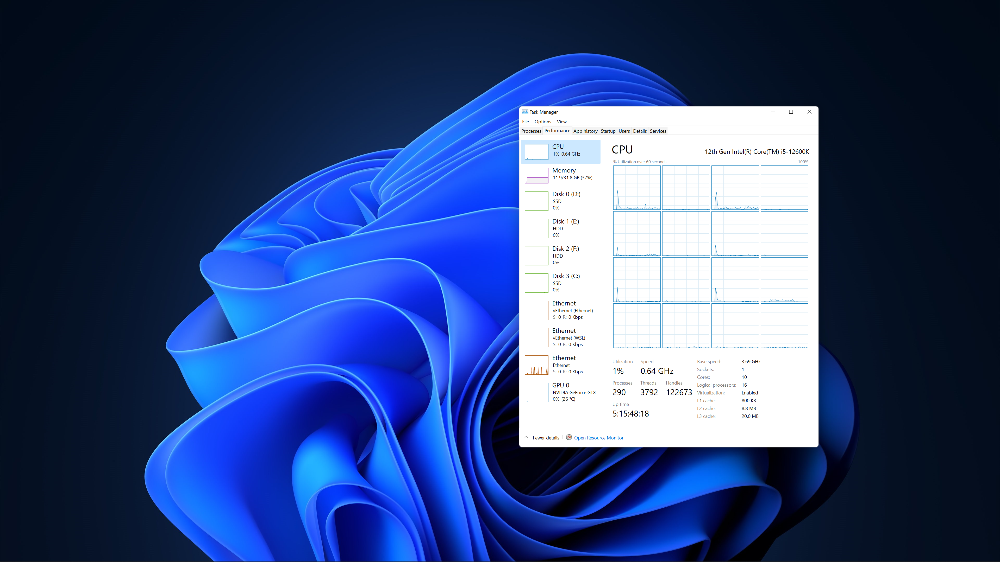

## PC 入れ替えの続き

ハードウェアの準備は一通り完了して、マザーボードの UEFI 設定画面を起動することができた。
デフォルトだと派手に光を放っていたので、スッと無効化しておく。

CPU、Memory、GPUが問題なく認識されていることを確認したり、冷却ファンの回転数を調整して遊んでみたりした後、
さて、ブートシーケンスの順序でも設定するか、とそれらしい画面に切り替えてみたが、ブート可能な HDD が1つも無い。

あれ？ M.2 の取付ソケット間違えたかな？ SATA も3つとも接続ミスしてるとかあるのか？と思い、  
再起動して F11 キーを連打するも「ブート可能なデバイスがありません」となる。

まあいいか・・・Windows 10 のインストールメディア(USB)入れて起動すればディスクが見えるかどうか分かるはず  
・・・しかし、このインストールメディアすら認識されない。

ここから UEFI の設定値を1つづつチェックする作業が始まった。。。

## 何が問題だったのか

結論から言うと、Windows 10 のインストールメディア(USB)を使っていると UEFI では認識されない。

> [【OSインストール】Windows10のUSBメモリーはUEFIブートできないため作り直す必要あり](https://nomadit.jp/pc/windows/post-11298)

このブログに書いてある通りで、 Rufus を使って USB メモリーに Windows 10 の ISO データを書き込むことで UEFI ブートができるようになった。  
(今まで特に必要がなく、 USB メモリ※リムーバブルディスク を持っていなかったので 32GB で 1,000円くらいの製品を購入した)

### 試行錯誤

ここに行きつくまでに、セキュアブートを無効化したり、レガシー起動オプションを有効化したりと迷走してしまった。  
まさかメーカー純正のインストールメディアがレガシーなインストール方法にしか対応していないとは考えも及ばず、  
「このメディアを使って何か設定を変えれば UEFI ブート対応できるはず」というところで思考していたので、無駄に MBR インストールしてしまい
後から UEFI メディアでクリーンインストールをする羽目になった。

### MBR disk から [GPT disk](https://docs.microsoft.com/ja-jp/windows-hardware/manufacture/desktop/windows-and-gpt-faq?view=windows-11) への変換

MBR disk は UEFI から認識されない。  
せっかく UEFI ブート可能な USB メモリで Windows 10 インストーラ を起動しても、 MBR のディスクが見えることは無い。

そこで、[リファレンス](https://docs.microsoft.com/en-us/windows-server/storage/disk-management/change-an-mbr-disk-into-a-gpt-disk)を参考に
インストーラのディスク選択画面でコマンドプロンプトを起動(キーボードの「Shift」と「F10」を押下)し、 diskpart を使って GPT disk に変換する  
([日本語ページ](https://docs.microsoft.com/ja-jp/windows-server/storage/disk-management/change-an-mbr-disk-into-a-gpt-disk)だと
コマンドの表記がおかしいので注意)

GPT disk に変換した後は、 UEFI のブート選択画面からも参照できるようになった！

このタイミングで、レガシー起動オプションは無効化してセキュアブートを有効化した。

## Windows 11 のインストール

Windows 10 のインストールが成功し、セキュリティアップデートもすべて適用した状態で Windows 11 のアップデートツールを実行した。  
M.2 の書き込みが高速なお陰で、ほとんど時間もかからず無事にアップデートが完了。
足掛け4日かけて新しい OS の UI を目にすることができた。

## アプリケーションのインストール

`winget` がかなり使いやすくなっていて、 Windows 11 だと標準でインストールされていた。
パッケージ名を指定して install するスクリプトを用意しておくだけで、ほとんど自動的に必要なツールのインストールが終わってしまった。

設定を復元するスクリプトも作っておくともっと楽ができそうだが、バージョンの差異によって微妙に挙動が違ったりするので
このあたりは動作確認も兼ねて手動操作で見ていく感じでも良いかも知れない。

## 終わり

PC 入れ替えも完了して、なにもかもがサクサク動作しており、Windows 11 使い倒してみようという気持ちになっている。

今のところ Windows 10 で動作していて 11 では動かないというものは一つもない。  
UI は好き嫌いあると思うが、角丸のウィンドウデザインはしばらく使っていたら慣れてしまった。

エクスプローラのコンテキストメニューは、分かりやすさを追及して現状の形になったと思われるが、
かなりの頻度で「Show more options」を選んで旧来のコンテキストメニューを表示している気がする。  
日常的な操作性は少しづつカスタマイズしていこうと思う。

せっかくだから近いうちに [WinUI 3](https://docs.microsoft.com/en-us/windows/apps/winui/) にも入門してみようかな。
