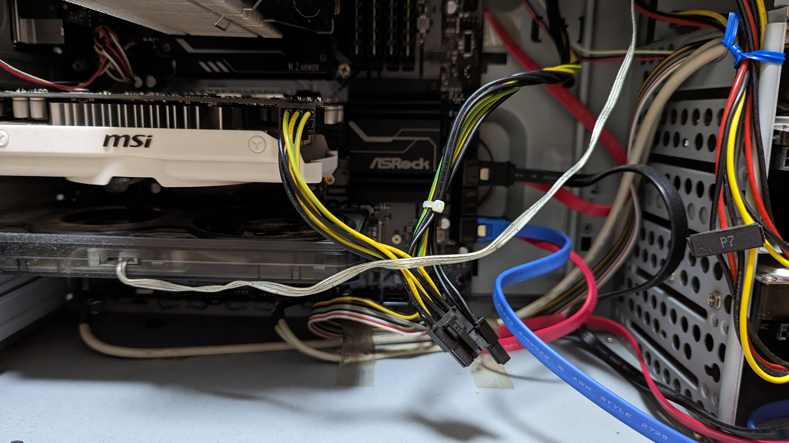

## 久々の更新

仕事にかまけてまったく更新しなくなってしまった。

## GPU の入替

2022-02 に CPU などの入れ替えをしたときは、 まだまだ高値だった GPU を見送っていた。  
そんな中、2022年は画像生成系 AI が流行りに流行って、試しに動かしてみたが  
GTX950 の持つ 2G メモリではとてもじゃないが生成に時間がかかりすぎて遊べない。  

「GPU 高いし、また数年後に CPU とか一式入れ替えのときにまとめて交換かなぁ」と思っていたが、  
GPU の価格が結構下がってきていることを観測し、「このくらいなら買っちゃうか」と衝動買い。  

画像生成に使えるスペックで10万円以内、みたいな探し方をしていて、5年くらいは使えてほしいな...という希望を持って RTX4070 をチョイス。  
2023-06 の購入時は 90,889円だったが、1か月経過して価格はさらに下がっていたので、しばらく待っていても良かったかも。  
まぁ欲しいと思った時が買い時だと信じているので、良いタイミングだったと思う。

## GPU 取付

GTX950 の電源は6ピン、 RTX4070 は8ピンなので、大丈夫かな...？と事前に確認。

8ピンの空きがあったので一安心。  
電源ユニットは750Wまでいけるので、RTX4070の動作にも耐えられそうではある。  
しかし、これまで1回も交換してないな、そろそろ故障しておかしくないな。

実際に届いてから入れ替えするのは非常に簡単で、入れ替え後の作業はドライバの最新化くらいだった。  
なんとなく Game Ready → Studio に変更。

## 画像生成

サクサクと生成ができるようになった。  
ベンチマークなどはやってないが、手持ちのゲームも4K最高画質にしてストレスなく動作することを確認。

NVIDIA Broadcast 

## 中古パーツの買取について

入れ替えによって使わなくなったパーツを今回もじゃんぱらに持って行ってみた。  
箱が無かったのでマイナス200円。

| Parts | Spec | Price |
| ----- | ----- | -----:|
| GPU | MSI GTX950 2GD5 OC | 2,000 → 1,800 |
